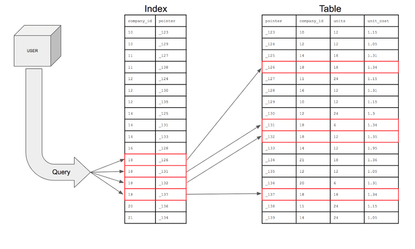
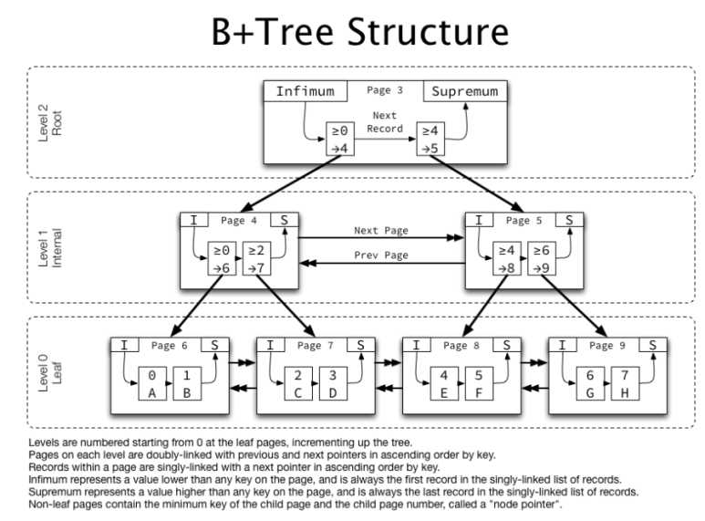

# 아이템 11. equals를 재정의 하려거든 hashcode도 재정의하라

 - ## equals() 와 hashcode() 의 차이
   - ### equals() : 두 개의 객체가 논리적으로 동등한가, 즉 두 객체가 같은 값을 가지고 있는가   
   - ### hashcode() : 각 객체를 식별하는 일련의 숫자로 HashMap, HashSet 에서 사용
 - ## HashCode 규약
   - ### equals 비교에 사용하는 정보가 변경되지 않았다면 hashcode는 매번 같은 값을 리턴해야 한다.   
        ### (변경되거나, 애플리케이션을 다시 실행한다면 달라질 수 있다.)
   - ### 두 객체에 대한 equals 가 같다면, hashcode의 값도 같아야 한다.
   - ### 두 객체에 대한 equals가 다르더라도, hashcode의 값은 같을 수 있지만, 성능이 저하될 수 있다.
 - ## hashcode 구현 방법 (67p ~ 71p 예제코드 11)
   - ### 핵심 필드 하나의 값의 해쉬값을 계산하여 result 값을 초기화
   - ### 타입에 맞는 hashcode 메서드 호출, result = 31 * result + 해당 필드의 hashCode를 계산한 값
     - ### 기본타입 : type.hashCode()
     - ### 참조타입 : 해당 필드의 hashCode()
     - ### 배열 : 모든 원소를 재귀적으로 모든 로직을 적용하거나, Arrays.hashCode를 사용
   - ### result 를 return
 - ## 재정의 시 주의할 점
   - ### 스레드 안정성
   - ### 모든 필드에 대해서 해시코드를 계산
   - ### 해시코드 계산 규칙을 API에 노출하지 않는 것이 좋음
 - ## hashcode 구현 대안
   - ### Objects 클래스의 hash 메서드
   - ### Lombok @EqualsAndHashCode

 - ## Feat
   - ### 해쉬 충돌과 연결리스트, B+Tree (MySQL)
   - 
   - 
   - ### 스레드 안정성 : Synchronization, ThreadLocal, 불변 객체