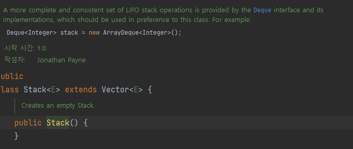

# 아이템 18. 상속보다는 컴포지션을 사용하라

 - ## 상속
   - ### 기존에 정의되어 있는 클래스의 필드와 메소드를 물려받아 새로운 클래스를 생성하는 기법
   - ### 중복코드 제거와 기능 확장을 쉽게 할 수 있다.
   - ### 클래스들의 계층적인 구조를 만들 수 있다.
 - ## 상속의 문제점 (예시코드 18 - 1)
   - ### 캡슐화를 깨뜨림 
     - ### 상위 클래스의 구현이 하위 클래스에게 노출
     - ### 자식 클래스는 부모 클래스에 강하게 결합 및 의존 하게 됩니다.
     - ### 상위 클래스가 어떻게 구현되느냐에 따라 하위 클래스의 동작이 달라질 수 있다
     - ### 상위 클래스의 내부 구현이 달라지면 하위 클래스가 오작동할 수 있다.
   - ### 부모 클래스의 결함은 자식 클래스에게 넘어옴 (Stack, Vector)
     - ### Stack 은 Vector 를 상속하고 있음
     - ### Vector 는 get() / set() 역할을 하는 모든 메소드에 synchronized 키워드가 붙어 있음
     - ### 원소를 탐색할 때마다 get() 메소드의 실행을 위해 계속 Lock
     - ### Thread - safe 하지만 오버헤드가 켜져 비효율적임
   - 
 - ## 조합 (Composition)
   - ### 기존 클래스를 확장하는 대신에 새로운 클래스를 만들고 private 필드로 기존 클래스의 인스턴스를 참조하게 하는 설계
 - ## 조합의 장점 (예시코드 18 - 2, 18 - 3)
   - ### 새로운 클래스는 기존 클래스의 내부 구현 방식의 영향에서 벗어남, 따라서 새로운 메소드가 추가되어도 영향 x
   - ### 메서드를 호출하는 방식으로 동작 -> 캡슐화를 깨뜨리지 않음
   - ### 상위 클래스에 의존하지 않기 때문에 변화에 유연
 - ## 상속을 쓰기위한 조건
   - ### 명확한 IS - A 관계 : A 를 상속하는 클래스 B가 있을 때, "B 가 정말 A 인가?"
   - ### 상위 클래스가 확장할 목적으로 설계되고, 문서화도 되어 있는 경우
   - ### 상위 클래스와 하위 클래스 모두 같은 개발자가 통제하는 패키지안에서
 - ## Spring 에서의 Composition
   - ### DI
   - 