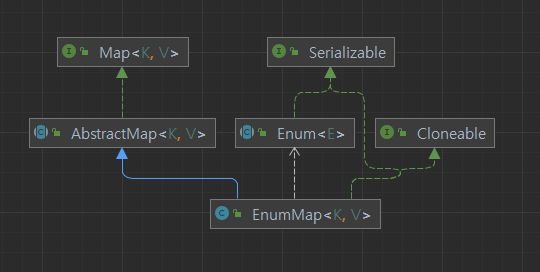

# 아이템 37. Ordinal 인덱싱 대신에 EnumMap을 사용하라

 - ## Ordinal 인덱싱의 문제점 (예시 코드 37-1)
   - ### 배열은 제네릭과 호환되지 않는다. 따라서 비검사 형변환을 수행해야한다. 
   - ### 배열은 각 인덱스가 의미하는게 무엇인지 알지못합니다. 때문에 출력 결과에 직접 레이블을 달아야 한다.
   - ### 정수는 열거 타입과 달리 타입이 안전하지 못하기 때문에, 정확한 정수값을 사용한다는 것을 직접 보증해야 한다.
 - ## EnumMap을 이용한 해결 (예시 코드 37 - 2)
   - ### 이전 ordinal을 사용한 코드와 다르게 안전하지 않은 형변환을 사용하지 않습니다.
   - ### EnumMap은 toString을 재정의하였기 때문에 결과를 출력하기 위해 번거로운 과정을 간소화
   - ### ordinal을 이용한 배열 인덱스를 사용하지 않으니 인덱스를 계산하는 과정에서 오류가 날 가능성이 존재하지 않는다.
   - ### EnumMap은 그 내부에서 배열을 사용하기 때문에 내부 구현 방식을 안으로 숨겨서 Map의 타입 안정성과 배열의 성능을 모두 얻어냈다.
 - ## EnumMap의 Details
   - ### EnumMap은 Map 인터페이스를 구현하고 AbstractMap을 상속받아 Enum에 특화된 Map을 제공합니다.
 - 
   - ### Java Collections Framework 중 하나이며 동기화되지 않습니다.
     - ### 동기화가 필요하다면 Collcetions.sysnchronizedMap으로 Wrapping 하는 것이 좋습니다.
   - ### 정렬된 컬렉션이며 키의 순서로 유지 된다. ( Enum클래스 내에서 상수가 선언된 순서 )
   - ### EnumMap 인스턴스의 모든 key값은 동일한 Enum유형이여야 한다.
   - ### EnumMap은 key에 null값을 허용하지 않는다. (NPE)
   - ### EnumMaap은 내부적으로 배열로 표현되므로 더 나은 성능을 제공한다.
   - ### 일반적으로 HashMap보다 훨씬 빠르다. (보장 X)
     - ### 1억 Get() 메서드를 돌린결과 약 2.5배 좋은 퍼포먼스를 보여줍니다.
     - ### 내부 구현이 배열로 이루어져 있습니다.
     - ### Hashing 처리를 하여 index를 생성하는게 아닌, Key의 선언 순서를 통해 index를 사용합니다.
     - ### O(1)이라는 시간 복잡도를 가져 매우 효울적입니다.
 