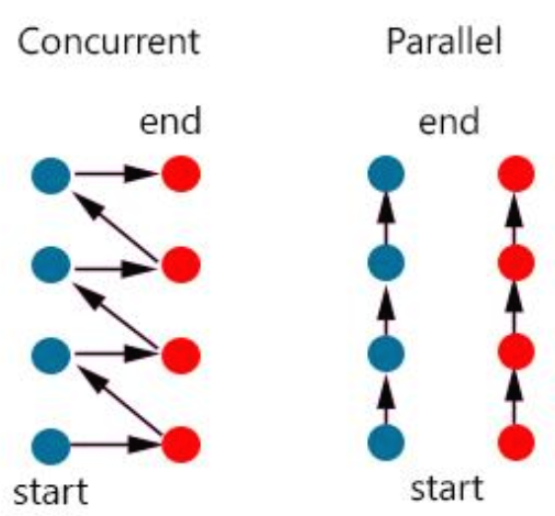
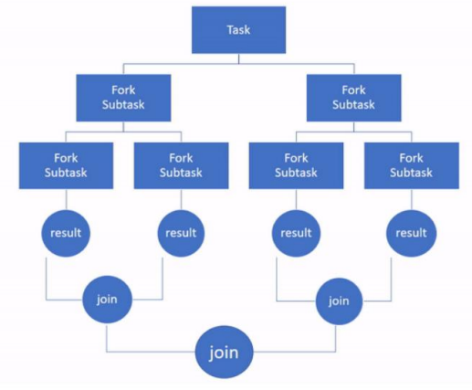
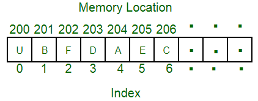
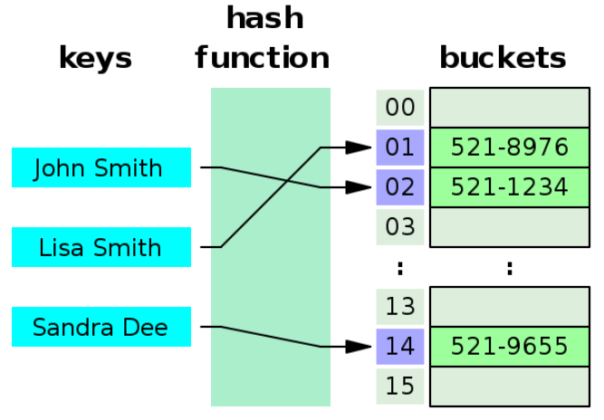
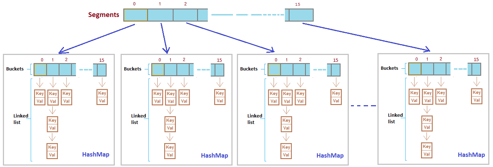
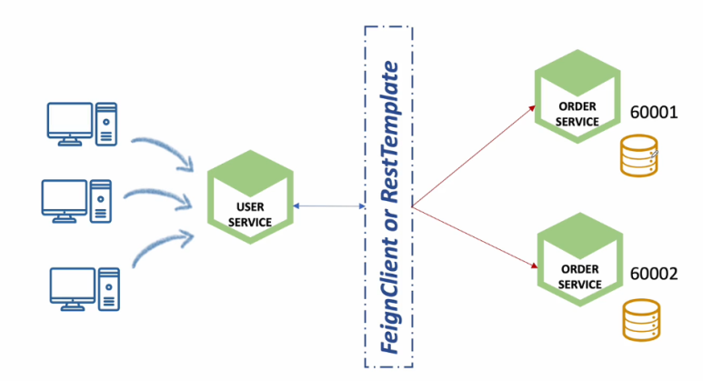
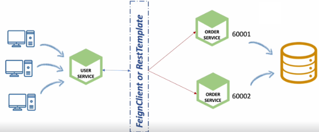
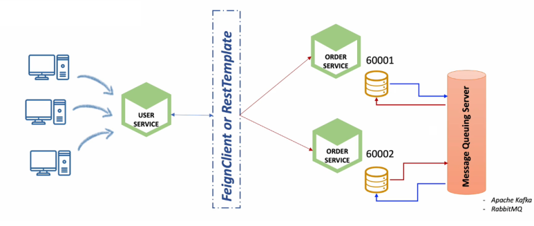
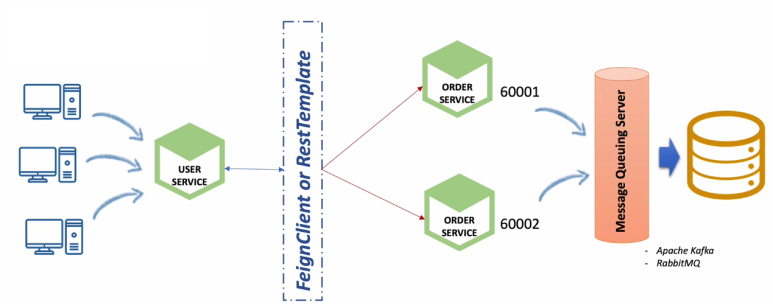

# 아이템 48. 스트림 병렬화는 주의해서 적용하라

 - ## 용어 정리
   - ### 동시성 (Concurrency)
     - ### 여러 작업이 동시에 실행되는 것처럼 보이는 개념
     - ### 실제로 동시에 일어나는 것이 아닌 여러 작업이 번갈아가며 실행되는 것
     - ### 싱글 코어 환경에서의 멀티작업은 병렬이 아닌 동시성 작업
   - ### 병렬성 (Parallelism)
     - ### 실제로 여러 작업이 동시에 동작하고 실행되는 것
     - 
   - ### 데이터 병렬성 (Data Parallelism)
     - ### 전체 데이터를 여러 서브 데이터로 만들고, 서브 데이터를 병렬 처리해 작업을 처리하는 것
     - ### 병렬 스트림은 데이터 병렬성을 의미 (구현)
   - ### 포크 조인 (ForkJoin)
     - ### Java 7부터 사용가능한 Java Concurrency 툴, 동일한 작업을 여러개의 Sub Task로 분리 (Fork)하여 각각 처리하고, 이를 최종적으로 합쳐서 (Join) 결과를 만들어 내는 방식
     - 
   - ### 스트림 병렬화
     - ### parallel() 메서드를 통해 스트림을 병렬 스트림으로 변환
     - ### 내부적으로 Fork/Join Framework를 사용해서 작업을 병렬로 처리
 - ## 주의 사항 - 스트림 소스
   - ### 효과가 좋은 스트림의 소스
     - ### ArrayList, HashMap, HashSet, ConcurrentHashMap의 인스턴스, 배열, int, long 범위
   - ### 데이터를 원하는 크기로 나누기 쉽고, 다수의 스레드에 분배하기 좋음
     - ### ArrayList, 배열은 인덱스를 기반으로 데이터를 쉽게 분할할 수 있음
     - 
     - ### HashMap, HashSet는 해시 버킷을 사용하여 요소를 저장하는데 이 버킷은 서로 독립적인 공간으로 나뉘어져 있음
     - 
     - ### ConcurrentHashMap 동시성을 지원하기 위해 세분화된 분할 기능을 가지고 있음
     - 
     - ### int, long 기본적인 숫자 데이터 타입이라 간단한 내부구조를 가지고 있음
   - ### 참조 지역성이 뛰어남
     - ### ArrayList 와 배열 : ArrayList는 내부 구조가 배열, 배열은 연속적인 메모리에 요소를 저장하기 때문에 요소들간 참조를 매우 빠르게 접근 가능
     - ### HashMap, HashSet, ConcurrentHashMap: 해시 함수에 의해 버킷에 매핑되어 저장, 비슷한 해시코드는 인접 위치에 저장(특정 해시 버킷), 해시 버킷의 요소들은 함께 저장됨
 - ## 주의 사항 - 중간 및 최종 연산
   - ### Stream 연산은 중간 연산과 최종 연산으로 구분, 중간 연산은 여러 단계의 연산을 적용, 최종 연산은 실제 결과를 생성하거나 반환
   - ## 주의해야 할 중간 연산
     - ### limit() : 순차적으로 데이터를 처리함으로 병렬화의 이점이 제공 X
     - ### sorted() : 정렬된 상태를 유지 (Statusful 연산)-> 병렬 처리 시 스레드간 데이터를 동기화 과정이 필요 -> 동기화 문제를 유발, 따라서 Statusless 연산을 사용해야 함
   - ## 주의해야 할 최종 연산
     - ### forEachOrdered() : 병렬 스트림의 요소들을 다시 순차적으로 처리 -> 병렬 처리의 성능이 저하 할 수 있음
     - ### reduce() : 병렬 스트림에서 가장 적합한 연산, 결합 법칙을 고려해야 함
       - ### 요소들을 결합하여 단일 결과를 생성 : [1][2][3] -> 6
       - ### 결합 법칙 고려
         - ### 덧셈 : a + (b + c) == (a + b) + c
         - ### 뺄셈 : a - (b - c) ?? (a - b) - c
       - ### 따라서 min, max, count, sum 처럼 완성된 형태로 제공하는 메서드 중 하나를 선택
       - ### anyMatch, allMatch, noneMatch
     - ### collect() (가변 축소): 요소를 수집하거나 그룹화하여 최종 결과를 생성
       - ### ex) 동일한 단어끼리 묶고 개수를 세는
       - ### 새로운 컬렉션들을 생성하고 요소를 추가하고, 다시 합치는 과정에서 리소스의 낭비가 심함 
 - ## 주의 사항 - 난수로 이루어진 스트림의 병렬화
   - ## ThreadLocalRandom
     - ### 단일 스레드에서 사용하고자 만들어짐, SplittableRandom 비교적 성능이 떨어짐
   - ## SplittableRandom
     - ### 이름과 같이 분할 가능성(Splittable) -> 분할이 가능 -> 다중 스레드 환경에서 안전하면서, 스레드에게 스트림을 분할하기에 적합
 - ## MSA 데이터 동기화 문제
   - ### 병렬 스트림은 스트림의 연산을 병렬로 처리하여 여러 스레드에서 동시에 요소를 처리하는 기능을 제공합니다.
   - ### 분산 시스템에서 데이터를 여러 인스턴스로 나누어 처리하는 것과 유사한 개념
   - ### Spring Cloud Gateway : Netty Server, RR, LoadBalancing
   - 
   - ### Solution 1 - 단일 Database
     - ### 분산 트랜잭션의 구현과 관리의 어려움
   - 
   - ### Solution 2 - MQ Server
     - ### 한쪽에서 발생한 데이터를 MQ Server에 전달
     - ### MQ Server는 변경된 데이터가 있으면 구독 신청한 서비스에 대해 해당 데이터를 가져와 Database에 업데이트
   - 
   - ### Solution 3 - 단일 Database + MQ Server (복합)
     - ### 단일 Database로 동기화 문제를 해결하고
     - ### MQ Server를 통해 안정적이고, 비교적 간단하게 Transation을 관리
   - 
 - ## reference
   - https://javabypatel.blogspot.com/2016/09/concurrenthashmap-interview-questions.html
   - https://blog.naver.com/smileman___/